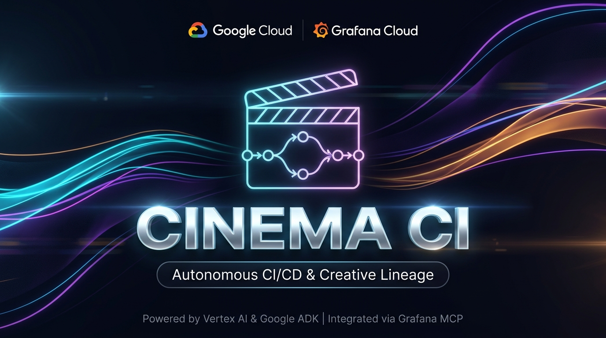
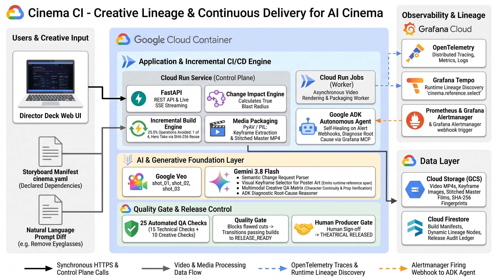

# Cinema CI — 生成AI映画制作のための実行時クリエイティブリネージ基盤

<div align="center">

[](https://opensource.org/licenses/Apache-2.0)
[](https://cloud.google.com/)
[](https://grafana.com/)
[](https://github.com/google/adk)
[](https://youtu.be/fM0Q5CqtAoA)

**クリエイティブな決定をトレースし、影響範囲を予測し、陳腐化したアセットのみをインクリメンタルに再構築する。**

[🎬 デモ動画 (3分)](https://youtu.be/fM0Q5CqtAoA) · [🎥 変更前フィルム](https://youtu.be/5rd_jhhyUZ8) · [✨ 変更後フィルム](https://youtu.be/NFjmPEYDuWY) · [English README](README.md) · [アーキテクチャ仕様書](docs/ARCHITECTURE.md) · [デプロイ手順](docs/DEPLOYMENT.md) · [Grafana ガイド](docs/GRAFANA_GUIDE.md)

<br/>

[](https://youtu.be/fM0Q5CqtAoA)

> 🎬 **生成映画マスターフィルム**:  
> • **変更前マスターフィルム（ベースライン：メガネ着用）**: [https://youtu.be/5rd_jhhyUZ8](https://youtu.be/5rd_jhhyUZ8)  
> • **変更後マスターフィルム（インクリメンタル：メガネ除去・Shot 02完全再利用）**: [https://youtu.be/NFjmPEYDuWY](https://youtu.be/NFjmPEYDuWY)  

</div>

---

## Cinema CI とは？

生成AIを活用した映画・映像制作（Generative Filmmaking）における最大の課題は、**「監督やプロデューサーが後から設定を1箇所変更した時、何を作り直すべきかが分からなくなる」** ことです。

従来のソフトウェア開発と異なり、AI映像制作パイプラインでは**「実行時に動的に生まれる依存関係（Runtime Dependencies）」**が存在します。
例えば、AIアートディレクター（Gemini）が各カットの生成動画の中から「最も構図が良い1フレーム」を実行時に選定して劇場ポスターを生成する場合、静的な設定ファイル（`cinema.yaml`）にはどのカットがポスターに使われたかは事前に記載されていません。

Cinema CI は、こうしたAIによる動的な創作上の意思決定を **Grafana Tempo** の分散トレーススパンとして記録し、次の変更時に公式 **Grafana MCP（Model Context Protocol）** を介して参照します。

```text
クリエイティブな変更指示（自然言語）
      ↓
Google ADK + Gemini 3.8 Flash（セマンティック解釈）
      ↓
宣言的依存関係（cinema.yaml）
          ∪
実行時観測リネージ（Grafana Tempo トレース / 公式 mcp-grafana 経由）
      ↓
真の破壊半径（True Blast Radius）
      ↓
差分再構築（4アセット再生成 / 3アセット完全再利用） → マルチモーダルQA → 人間によるリリース承認
```

---

## 象徴的シナリオ（Hero Scenario）

映画監督が以下の指示を出したとします：

> **「Marcus（主人公）の丸メガネを外してくれ。」**

### 1. 宣言的依存の特定
静的なマニフェスト（`cinema.yaml`）から、Marcus が出演している `Shot 01` および `Shot 03` が影響を受けることが分かります。

### 2. 実行時リネージの発見（★ 最大の差別化要因）
しかし、前回のビルドにおいて、Gemini は実際に生成された動画の各フレームを視覚的に評価し、**`Shot 03` のキーフレームを劇場ポスターの原画として動的に採用**していました。
この実行時の決定は、OpenTelemetry スパンとして Grafana Tempo に記録されています：

```text
span: cinema.reference.select
  attributes:
    cinema.consumer = "poster"
    cinema.reference.selected = "shot_03:keyframe:v1"
    cinema.selection.reason = "Shot 03 のキーフレームが、劇場ポスターとして最も力強い主人公のフレーミングと構図を提供。"
    cinema.source.sha256 = "28531fd8"
```

### 3. 真の破壊半径（True Blast Radius）の算出
Google ADK エージェントは、公式 Grafana MCP 経由で Tempo からこのスパンを取得し、ポスターも再構築対象に含めます：

$$\text{True Blast Radius} = \text{宣言された依存} \cup \text{実行時に観測されたリネージ}$$

この結果、パイプラインは以下の決定を下します：
- **再構築（REBUILD）: 3 アセット**
  - Shot 01（Marcus 出演シーン ➔ Veo 3.1 で再生成）
  - Shot 03（Marcus 出演シーン ➔ Veo 3.1 で再生成）
  - **Poster（★ Tempo のトレース証跡から Shot 03 への動的依存を発見したため自動再構築）**
- **安全な完全再利用（BYTE-IDENTICAL REUSE）: 1 アセット**
  - Shot 02（Marcus が登場しない封筒の手元アップ ➔ 高価な Veo 3.1 動画生成を完全スキップし前回の動画をそのまま再利用）
- **動画生成処理の削減: 33.3% 回避（全3カット中、不要な1カットのAI動画生成をスキップ）**
- **成果物パイプライン全体の処理削減: 25.0% 回避（全4成果物中、不要な1処理をスキップ）**

再利用された Shot 02 は、ベースラインと**SHA-256ハッシュが完全に一致（バイト単位で同一）**することが暗号学的に証明されます。

---

## なぜ Grafana が「製品ロジックの核心」なのか？

Cinema CI において、Grafana は単なる「後から見るダッシュボード」ではありません。

> **「静的マニフェストは『何が依存すべきか』を示す。Grafana Tempo は『実行時に実際に何が依存したか』を証明する。」**

Cinema CI は制作パイプラインの OpenTelemetry スパンを Grafana Cloud に送信します。Google ADK エージェントは、公式の `mcp-grafana` サーバーを通じて STDIO JSON-RPC 2.0 経由で Tempo を直接クエリし、その証跡を入力として確定的な影響範囲（Impact Plan）を計算します。

つまり、**Grafana は AI 映画制作パイプラインの「実行メモリ（外部記憶装置）」として自律システムの意思決定に不可欠な役割**を果たしています。

---

## コア機能

### 1. 変更影響分析インテリジェンス（Change Impact Intelligence）
- 自然言語の映画監督指示（「Marcus のメガネを外す」「Alice のコートを赤にする」等）を Gemini 3.8 Flash が構造化された変更リクエストにパース。
- 公式 Grafana MCP 経由で直前のビルドの Tempo トレースを検索。
- グラフ探索アルゴリズムにより、最小限の再構築計画を確定的に出力。

### 2. 視覚的 DAG リネージグラフ（Visual DAG Graph）
- 意図（Stage 0） ➔ 制作（Stage 1） ➔ 成果物（Stage 2）の流れを SVG ベジェ曲線で描画。
- **Grafana Tempo が発見した実行時エッジ（Shot 03 ➔ Poster）を、流れるネオンパープルのパルスアニメーションで直感的に可視化**。
- ノードをクリックすると、右ペインの「Runtime Evidence Inspector」にスパンID、AIの選定理由、確信度、SHA-256ハッシュが即座に連動表示。

### 3. バイト単位の差分再利用（Byte-Identical Reuse）
- 影響のないアセットは再生成（Veo呼び出し）を一切行わず、前回のビルドから即座にコピー。
- SHA-256 ハッシュを記録し、不要な動画生成処理を完全にスキップ。

### 4. マルチステージ映像 QA マトリクス
- **技術 QA (PyAV / FFmpeg)**: コーデック、解像度、アスペクト比、フレームレート、黒飛び・無音検知。
- **クリエイティブ QA (Gemini 3.8 Flash マルチモーダル動画解析)**: キャラクターの衣装・持ち物・特徴が契約（`cinema.yaml`）を満たしているかを映像から検証。
- **シーン間整合性検証**: カットをまたいでも同一人物としての一貫性（顔立ち、肌の色、年齢感）が保たれているかをマルチモーダル比較。

### 5. 人間承認ゲート付き継続的デリバリー（Human Release Gate）
- 全25項目の多層QAテストにパスしたビルドのみが `RELEASE_READY` に遷移し、最終マスターフィルム（Final Cut）へ自動スティッチング。
- プロデューサーによる手動プロモート（`Promote to Release`）を経て初めて本番公開（`RELEASED`）される安全設計。

### 6. 自律型インシデント調査・外科的修復エージェント
- Grafana Alertmanager からリグレッション検知アラートを受信すると、Google ADK エージェントが自動起動。
- Prometheus メトリクス、Loki ログ、Tempo トレースを調査し、失敗したカットのみをピンポイントで再生成して自動修復。

### 7. 現場クリエイターのための完全レスポンシブ UI
- ゼロビルド（ES Modules + CSS Tokens）による高速・軽量フロントエンド。
- ロケ現場や移動中の監督・クリエイターが、スマートフォンやタブレットからでも 25 項目 QA の合否確認と「Promote to Release（人間承認ゲート）」を快適に操作可能。

---

## アーキテクチャ

[](docs/images/architecture.jpeg)

```text
Web ブラウザ (UI)
   │
   ▼
Cloud Run Service (Cinema CI コントロールプレーン)
   ├── FastAPI (Web UI & REST API)
   ├── Google ADK + Gemini 3.8 Flash
   ├── 決定論的 ImpactEngine
   └── 公式 mcp-grafana (STDIO JSON-RPC 2.0) ──▶ Grafana Cloud (Tempo / Loki / Prometheus)
               │
               ├── Firestore (ビルド・影響分析・リリースメタデータ)
               │
               └── Cloud Run Jobs (ビルドワーカー)
                     ├── Google Veo 3.1 (Vertex AI 映像生成)
                     ├── Gemini 3.8 Flash (映像マルチモーダル QA)
                     ├── PyAV / FFmpeg (技術検証 & スティッチング)
                     └── Google Cloud Storage (動画・画像・成果物ストレージ)
```

---

## 実行モードとローカル起動方法

### モード 1: 通常本番モード (Strict Mode)
Vertex AI（Veo 3.1 & Gemini 3.8 Flash）および公式 Grafana Cloud MCP を使用する完全な本番モードです。外部サービスのエラーや認証不備が発生した場合、**フェイクやモックに逃げず厳格にエラー（Fail Fast）** となります。

```bash
# シェルスクリプトで起動（引数なし・仮想環境自動ロード）
./run_prod.sh

# または直接コマンド実行
source .venv/bin/activate
MOCK_MODE=false STRICT_MODE=true GENERATOR_TYPE=veo uvicorn app.main:app --host 0.0.0.0 --port 8080 --reload
```

ブラウザで [http://localhost:8080](http://localhost:8080) にアクセスします。

---

### モード 2: 完全オフライン・モックモード (`MOCK_MODE=true`)
API課金なし・Google Cloud 認証なし・オフライン環境で、全機能・UIをミリ秒単位の超高速で検証できる専用モードです。

```bash
# シェルスクリプトで起動（引数なし・仮想環境自動ロード）
./run_mock.sh

# または直接コマンド実行
source .venv/bin/activate
MOCK_MODE=true STRICT_MODE=false GENERATOR_TYPE=fixture uvicorn app.main:app --host 0.0.0.0 --port 8080 --reload
```

* **動画生成**: Veo を呼ばず、同梱された `fixtures/` の映像アセットを瞬時に複製。
* **変更解析**: Gemini を呼ばず、決定論的ルールパーサーが即座に変更意図を抽出。
* **映像 QA**: Gemini マルチモーダル QA を呼ばず、PyAV ピクセルアナライザーが全25項目を高速評価。
* **実行速度**: **フルビルドから最終マスターフィルム生成まで数秒で高速完走**（`RELEASE_READY` 到達）。
* **重要**: モック動作は **明示的に `MOCK_MODE=true` を指定した場合にのみ有効** となり、通常モードで勝手にフォールバックすることは絶対にありません。

---

## テストと検証

```bash
# 単体テストスイートの実行 (13テスト)
.venv/bin/python -m unittest discover tests

# Strict Mode / Grafana MCP 疎通検証スクリプト
.venv/bin/python scripts/test_strict_submission_e2e.py

# Cloud バックエンド疎通検証スクリプト
.venv/bin/python scripts/test_cloud_submission_e2e.py
```

---

## ライセンス

Apache License 2.0
