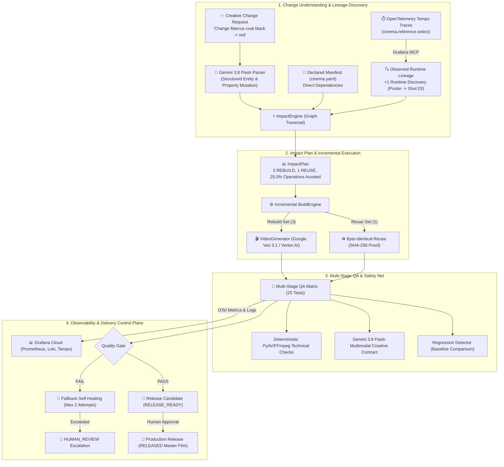

# Cinema CI — System Architecture & Technical Specification

> **Cinema CI** is an autonomous CI/CD and observability platform for generative AI filmmaking. It transforms generative filmmaking from prompt-and-pray into a disciplined, testable, and deterministic software engineering lifecycle.


```text
+-------------------------------------------------------------------------------------------------------+
|                                              CINEMA CI                                                |
|                                                                                                       |
|  +-------------------+      +-------------------------+      +-------------------------------------+  |
|  | Creative Change   | ---> | Change Impact Engine    | ---> | Incremental Build Engine            |  |
|  | ("Change coat...")|      | (Declared ∪ Observed)   |      | (3 Rebuild / 1 Byte-Identical Reuse)|  |
|  +-------------------+      +-------------------------+      +-------------------------------------+  |
|                                         ^                                       |                     |
|                                         | (Tempo Runtime Lineage)               v                     |
|  +-------------------+      +-------------------------+      +-------------------------------------+  |
|  | Human Gate        | <--- | Release Candidate       | <--- | Multi-Stage QA Matrix               |  |
|  | (PROMOTE TO PROD) |      | (PASS -> Stitched Film) |      | (PyAV Technical + Gemini Creative)  |  |
|  +-------------------+      +-------------------------+      +-------------------------------------+  |
+-------------------------------------------------------------------------------------------------------+
```

---

## 1. Architectural Overview

### The Problem Cinema CI Solves
In traditional generative video pipelines, any creative change (e.g. "Change Marcus's coat from black to red") forces filmmakers into one of two bad options:
1. **Naive Full Rebuild**: Blindly regenerate all shots and assets from scratch. Extremely slow, expensive, and breaks consistency on shots that were already perfect.
2. **Ad-hoc Manual Editing**: Manually guess which shots were affected. This inevitably misses dynamic downstream dependencies (such as theatrical posters or key visuals that dynamically sampled frames from other shots).

### The Cinema CI Solution
Cinema CI introduces **Change Impact Intelligence + Incremental CI/CD**:
- **Change Understanding**: Interprets natural language creative direction via Gemini 3.8 Flash into typed mutations (`CreativeChangeRequest`).
- **Observed Runtime Lineage**: Does NOT store static dependency graphs in Grafana. Instead, queries OpenTelemetry Tempo execution spans via Grafana MCP to discover dynamic runtime reference selections.
- **True Blast Radius**: Graph traversal computes $\text{True Blast Radius} = \text{Declared Dependencies} \cup \text{Observed Runtime Lineage}$.
- **Zero-Compute Asset Reuse**: Unaffected assets are mathematically guaranteed identical via SHA-256 fingerprints (`before == after`), skipping the generator entirely.
- **Multi-Stage QA**: Validates technical integrity (PyAV/ffmpeg) and creative contract conformance (Gemini 3.8 Flash).
- **Continuous Delivery**: Strict quality gate blocks flawed cuts; passing candidates reach `RELEASE_READY` and require explicit human promotion to reach production `RELEASED`.
- **Fallback Self-Healing**: Automated repair agent for regressions, capped at 2 attempts before escalating to `HUMAN_REVIEW`.



---

## 2. Core Subsystems

### 2.1. Change Impact Intelligence (`app/impact/`)
- **Semantic Prompt Parsing (`parser.py`)**:
  Uses Gemini 3.8 Flash structured outputs to parse changes into `CreativeChangeRequest(entity_id, property, old_value, new_value, change_type)`.
- **Declared Dependencies (`declared.py`)**:
  Extracts manifest dependencies from `cinema.yaml` (e.g. `character:marcus -> shot_01, shot_03`).
- **Observed Runtime Lineage (`observed.py`)**:
  Extracts dynamic references from Tempo execution traces (e.g. `cinema.reference.select` where `PosterGenerator` dynamically consumed a keyframe of `shot_03`).
- **Deterministic Policy Matrix (`policy.py`)**:
  Maps `(change_type, edge_type)` to deterministic actions (`REBUILD`, `REVALIDATE`, `REUSE`).
- **Blast Radius Engine (`engine.py`)**:
  Executes graph traversal across $\text{Declared} \cup \text{Observed}$ to compute minimal partition and calculate avoided operations.

### 2.2. Incremental Build Engine (`app/engine.py`)
- **Zero-Compute Reuse**:
  Unaffected assets (`shot_02` prop close-up) are copied directly from the baseline build without calling the video generator.
- **SHA-256 Fingerprinting**:
  Computes asset hashes to provide mathematical proof of non-rebuilt assets (`before == after`).
- **Runtime Lineage Telemetry**:
  Emits OpenTelemetry spans (`cinema.generate.shot`, `cinema.reference.select`, `cinema.reuse.shot`) and Loki event logs.

### 2.3. Multi-Stage QA & Regression Detection (`app/evaluator/`)
- **Technical QA (`technical.py`)**:
  PyAV and ffmpeg verify resolution (720p+), 16:9 aspect ratio, 24.0 fps framerate, audio streams, and black frame drops.
- **Creative QA (`creative.py`)**:
  Gemini 3.8 Flash inspects shots for character trait consistency (hair, coat, glasses), prop presence (blue envelope), and cross-shot identity continuity.
- **Regression Detection (`regression.py`)**:
  Compares new test results against baseline to catch unintended regressions.

### 2.4. Continuous Delivery & Human Release Gate
- When all quality gates pass, build transitions to `RELEASE_READY` (Release Candidate).
- Stitches the final master cut with `packaging.py`.
- Explicit human promotion endpoint (`POST /api/releases/promote/{build_id}`) seals the build into an immutable `ReleaseRecord` (`storage/releases.json`) and transitions state to `RELEASED`.

---

## 3. Grafana Cloud Integration

| Telemetry Type | Mechanism | Purpose |
| :--- | :--- | :--- |
| **Prometheus Metrics** | OTLP HTTP (`PeriodicExportingMetricReader`) | `cinema_ci_build_operations`, `cinema_ci_assets_rebuilt`, `cinema_ci_assets_reused`, `cinema_ci_generation_operations_avoided`, `cinema_ci_release_ready`, `cinema_ci_test_pass_ratio` |
| **Loki Logs** | OTLP Log Exporter | Structured lifecycle events (`change_requested`, `runtime_lineage_discovered`, `incremental_build_started`, `artifact_reused`, `release_promoted`) |
| **Tempo Traces** | OTLP Span Exporter | Distributed trace tree with `cinema.reference.select` dynamic selection spans |
| **Official Grafana MCP** | STDIO Subprocess (`uvx mcp-grafana`) | Autonomous querying of Prometheus, Loki, and Tempo |

---

## 4. Pluggable Storage & Execution Architecture (`app/store/`)

Cinema CI adopts a backend adapter architecture where Business Logic (`BuildEngine`, `ImpactEngine`, QA, Agent) remains 100% unified between Local Development and Cloud Run Production.

```text
                     ┌─────────────────────────────────────────┐
                     │          Business Logic Layer           │
                     │  BuildEngine / ImpactEngine / ADK Agent │
                     └───────┬─────────────┬─────────────┬─────┘
                             │             │             │
              ┌──────────────┘             │             └──────────────┐
              ▼                            ▼                            ▼
┌───────────────────────────┐┌───────────────────────────┐┌───────────────────────────┐
│       ArtifactStore       ││       MetadataStore       ││       BuildExecutor       │
│  - put_file / get_file    ││  - save_build / get_build ││  - submit_build           │
│  - copy / sha256 / exists ││  - save_release           ││  - cancel_build           │
└─────────────┬─────────────┘└─────────────┬─────────────┘└─────────────┬─────────────┘
              │                            │                            │
      ┌───────┴───────┐            ┌───────┴───────┐            ┌───────┴───────┐
      ▼               ▼            ▼               ▼            ▼               ▼
[LocalArtifact]  [GCSArtifact] [LocalMetadata] [FirestoreMeta] [LocalExecutor] [CloudRunJobExec]
  ./storage/       gs://...      JSON files     Firestore Doc   asyncio.Task   Cloud Run Job
```

- **`ArtifactStore`**:
  - `LocalArtifactStore`: Maps to `./storage/{build_id}/...` for transparent developer inspection (`ls storage/build_0001`).
  - `GCSArtifactStore`: Uses Cloud Storage with server-side blob copying (`bucket.copy_blob(...)`) for zero-download byte-identical reuse.
- **`MetadataStore`**:
  - `LocalMetadataStore`: Fast local file persistence (`storage/builds.json`, `releases.json`).
  - `FirestoreMetadataStore`: Durable document collections (`projects`, `builds`, `releases`, `impact_plans`) enabling state recovery across Cloud Run container restarts.
- **`BuildExecutor`**:
  - `LocalBuildExecutor`: In-process asynchronous task dispatch.
  - `CloudRunJobExecutor`: Calls Google Cloud Run Jobs API to run long-running builds in a dedicated `cinema-ci-build-worker` container (`python -m app.worker`), decoupling generation from HTTP timeouts.

