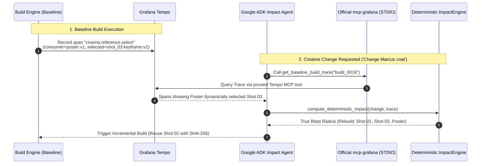

# Cinema CI — Grafana Cloud & Observability Guide

> This guide provides step-by-step instructions for inspecting **Cinema CI** telemetry on **Grafana Cloud**, importing dashboards, testing alerting rules, and understanding the OpenTelemetry and Model Context Protocol (MCP) integrations.

---

## 1. Quick Setup: Connecting to Grafana Cloud

Cinema CI streams telemetry via OpenTelemetry OTLP directly to Grafana Cloud.

### 1.1. Environment Configuration (`.env`)
```ini
# Grafana Cloud OpenTelemetry OTLP Gateway
OTEL_EXPORTER_OTLP_ENDPOINT=https://otlp-gateway-prod-ap-northeast-0.grafana.net/otlp
OTEL_EXPORTER_OTLP_HEADERS=Authorization=Basic%20<base64-encoded-instance-id-and-token>

# Grafana Cloud REST & Datasource Credentials (Optional for MCP)
GRAFANA_URL=https://<your-instance>.grafana.net
GRAFANA_SA_TOKEN=<your-service-account-token>
PROM_DATASOURCE_UID=grafanacloud-prom
LOKI_DATASOURCE_UID=grafanacloud-logs
```

---

## 2. Dashboard Import (`grafana/dashboard.json`)

Cinema CI comes with a pre-configured, production-ready dashboard.

### 2.1. Importing the Dashboard
1. Log into your **Grafana Cloud** instance (`https://<instance>.grafana.net`).
2. In the left sidebar, navigate to **Dashboards** ➔ **New** ➔ **Import**.
3. Copy the entire contents of [`grafana/dashboard.json`](../grafana/dashboard.json) and paste into the JSON box.
4. Select your **Prometheus** and **Loki** data sources and click **Import**.

### 2.2. Key Panels in the Dashboard

```
+-------------------------------------------------------------------------------+
|                             CINEMA CI MISSION CONTROL                         |
|                                                                               |
|  +--------------------------------+   +------------------------------------+  |
|  |       RELEASE GATE STATUS      |   |        TEST PASS RATE (GAUGE)      |  |
|  |     [ RELEASE READY (GREEN) ]  |   |               [ 100% ]             |  |
|  |    or [ RELEASE BLOCKED (RED) ]|   |     (Target: 100% Strict Pass)     |  |
|  +--------------------------------+   +------------------------------------+  |
|                                                                               |
|  +--------------------------------+   +------------------------------------+  |
|  |       ACTIVE REGRESSIONS       |   |        TOTAL BUILDS & REPAIRS      |  |
|  |               0                |   |          Builds: 4 | Repairs: 1    |  |
|  +--------------------------------+   +------------------------------------+  |
|                                                                               |
|  +-------------------------------------------------------------------------+  |
|  |                      CINEMA QA AUDIT LOGS (LOKI)                        |  |
|  |  [REGRESSION] shot_03: Marcus coat color mismatch (observed: red)       |  |
|  |  [PASS] shot_01: Technical resolution 1280x720 24fps                    |  |
|  +-------------------------------------------------------------------------+  |
+-------------------------------------------------------------------------------+
```

1. **Release Gate Status Panel**:
   - Expression: `cinema_ci_release_ready`
   - Green (`1`) when all creative and technical tests pass.
   - Red (`0`) when any regression or failing test is active.
2. **Test Pass Ratio Gauge**:
   - Expression: `cinema_ci_test_pass_ratio * 100`
   - Thresholds: 100% (Green), 80-99% (Yellow), <80% (Red).
3. **Active Regressions Counter**:
   - Expression: `cinema_ci_active_regressions`
   - Increments whenever a previously passing shot test fails in the current build.
4. **Structured QA Logs (Loki)**:
   - Query: `{service_name="cinema-ci"} | json`
   - Displays real-time test evaluations with Gemini multimodal observations and confidence scores.

---

## 3. Grafana Explore: PromQL & LogQL Queries

You can explore live data under **Explore** in the Grafana Cloud menu:

### 3.1. Prometheus PromQL Queries
| Use Case | PromQL Query |
| :--- | :--- |
| **Check Release Gate** | `cinema_ci_release_ready` |
| **Active Regressions** | `cinema_ci_active_regressions` |
| **Test Pass Rate** | `cinema_ci_test_pass_ratio` |
| **Build Volume** | `sum(cinema_ci_builds_total)` |
| **Self-Healing Count** | `sum(cinema_ci_repairs_total)` |

### 3.2. Loki LogQL Queries
| Use Case | LogQL Query |
| :--- | :--- |
| **All Cinema CI Logs** | `{service_name="cinema-ci"}` |
| **Regression Logs Only** | `{service_name="cinema-ci"} \| json \| status="REGRESSION"` |
| **Gemini Evidence Query** | `{service_name="cinema-ci"} \| json \| observed != ""` |

---

## 4. Distributed Tracing & Tempo Span Links

## 4. Distributed Tracing & Tempo Runtime Lineage

In Cinema CI/CD, **Grafana Tempo is the Source of Truth for Creative Runtime Dependencies.**



### 4.1. Key OpenTelemetry Spans in Tempo
| Span Name | Attributes | Meaning for Change Impact |
| :--- | :--- | :--- |
| **`cinema.reference.select`** | `cinema.consumer`: `poster:v1`<br/>`cinema.reference.selected`: `shot_03:keyframe:v1`<br/>`cinema.selection.reason`: `runtime_visual_composition_gemini_selection` | Proves Poster dynamically consumed Shot 03 keyframe. When Shot 03 is modified, Poster becomes stale and must be rebuilt. |
| **`cinema.generate.shot`** | `cinema.shot_id`: `shot_01`<br/>`cinema.output.sha256`: `ab459da05875945e` | Records generator output fingerprint for incremental proof. |
| **`cinema.reuse.shot`** | `cinema.shot_id`: `shot_02`<br/>`cinema.sha256`: `7f062bdf21b4b641` | Proves byte-identical reuse from baseline. |

---

## 5. Official Grafana MCP Tool Reference (`mcp-grafana`)

The Google ADK Agent interacts with Grafana Cloud via the **official Grafana MCP server (`mcp-grafana`)** running over STDIO:

| Agent Tool | Discovered Official MCP Tool | Parameters | Purpose |
| :--- | :--- | :--- | :--- |
| **`get_baseline_build_trace`** | `tempo_get-trace` / `tempo_query` / `grafana_api_request` | `{"traceId": "build_0016"}` | Retrieves Tempo distributed trace to extract observed runtime lineages. |
| **`query_grafana_metrics`** | `query_prometheus` | `{"expr": "cinema_ci_release_ready"}` | Checks metric state and quality gates. |
| **`query_grafana_logs`** | `query_loki_logs` | `{"logql": "{service_name=\"cinema-ci\"}"}` | Queries multimodal Gemini QA test observations. |
| **`get_firing_alerts`** | `alerting_manage_rules` | `{"operation": "list", "states": ["firing"]}` | Retrieves firing alerts during investigations. |

---

## 6. Strict Mode & Submission Assurance

Cinema CI/CD enforces **Strict Mode** (`STRICT_MODE=true` / `CINEMA_STRICT_MODE=1`):
- Silent fallbacks are **strictly forbidden on the agent evidence path**.
  `mcp_grafana.call_tool` raises on official MCP failure, and all submission
  tests verify `Fallbacks used = 0`.
- The read-only Telemetry *viewer* endpoint (`GET /api/telemetry/trace/{build_id}`)
  never 500s for display purposes; instead it returns `source`
  (`official-mcp-grafana` vs `runtime-mirror`) and `is_real_tempo` honestly.
  Submission video / screenshots must show `source = official-mcp-grafana`.

